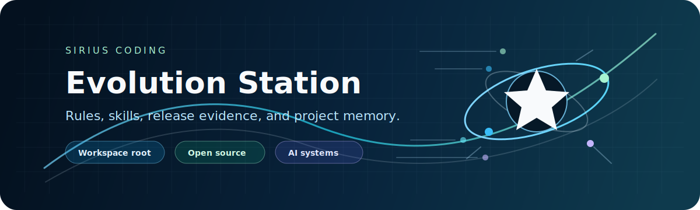

# Sirius Evolution Station Template

> A reusable Control Layer OS template for AI-assisted software work.
>
> 一个可复用的 AI 时代软件工程控制层模板，用来沉淀规则、skills、审查标准、公开边界、图形能力、发布证据和自动化检查。

<p align="center">
  
</p>

<p align="left">
  
  
  
</p>

<p align="center">
  <a href="#what-this-is">What This Is</a> ·
  <a href="#who-should-use-this">Who Should Use This</a> ·
  <a href="#3-minute-quick-start">3-Minute Quick Start</a> ·
  <a href="#minimal-example-flow">Minimal Example Flow</a> ·
  <a href="#core-links">Core Links</a> ·
  <a href="#mother-repository-relationship">Mother Repository Relationship</a> ·
  <a href="#security-boundary">Security Boundary</a>
</p>

## What This Is

This template is a root control layer for AI-assisted development. It gives a new workspace durable rules, reusable skills, public/private guardrails, audit scripts, diagram capability, release history, and contribution interfaces.

It is not a business application starter. Add implementation under `projects/` or connect independent project repositories after the control layer is in place.

## Who Should Use This

Use this template if you want:

- a workspace that remembers durable decisions outside chat
- a reusable root layer for multiple projects
- public-safe documentation and environment boundaries
- auditable AI-assisted development workflows
- a template that can evolve from a validated mother repository

Do not use this template if you only need a single application scaffold, want to commit private environment values, or plan to put business implementation directly into the reusable template.

## 3-Minute Quick Start

```bash
cp docs/ops/environment-registry.private.example.yaml docs/ops/environment-registry.private.yaml
./scripts/root-repo-structure-audit.sh --strict
```

Then read:

1. [AGENTS.md](./AGENTS.md)
2. [Quick Start](./docs/adoption/quick-start.md)
3. [Control Layer OS](./specs/workspace/control-layer-os.md)
4. [Public / Private Boundary](./specs/workspace/public-private-boundary.md)

## Minimal Example Flow

1. Create a new repository from this template.
2. Keep reusable rules and workflows in the root layer.
3. Add implementation under `projects/<project-name>` or in independent repositories.
4. Run `./scripts/root-repo-structure-audit.sh --strict`.
5. Promote repeated lessons into `docs/`, `specs/`, `skills/`, or `scripts/`.

See [Minimal Project Layout](./examples/minimal-project-layout/README.md).

## Core Links

| Asset | Purpose |
| --- | --- |
| [Contributing](./CONTRIBUTING.md) | Contribution boundary and validation requirements |
| [Security](./SECURITY.md) | Public/private safety policy |
| [Why This Template](./docs/adoption/why-this-template.md) | When this template is useful |
| [Mother Repository Relationship](./docs/adoption/mother-repo-relationship.md) | How the mother repo validates and syncs template assets |
| [Template Manifest](./docs/template/template-manifest.yaml) | Include/exclude source of truth for template sync |
| [Root Audit](./scripts/root-repo-structure-audit.sh) | Structure, link, version, diagram, and sanitization checks |
| [Template Adoption Skill](./skills/template-adoption/SKILL.md) | Reusable adoption workflow for future AI sessions |

## Evolution Workflow

<p align="center">
  
</p>

## Mother Repository Relationship

The mother repository `sirius-coding/sirius-coding` is the live validation workspace. This template repository is the reusable public baseline.

Template sync must preserve the boundary:

- include root control layer assets
- exclude `projects/`
- exclude root business aggregation builds
- exclude project-specific deployment details
- exclude private overlays and real environment values

## Security Boundary

This repository is public-facing. Use placeholders in tracked files and keep real environment values in ignored private overlays.

```bash
cp docs/ops/environment-registry.private.example.yaml docs/ops/environment-registry.private.yaml
```

## License

This repository uses [Apache License 2.0](./LICENSE). Future commercialization boundaries are described in [COMMERCIALIZATION.md](./COMMERCIALIZATION.md).
